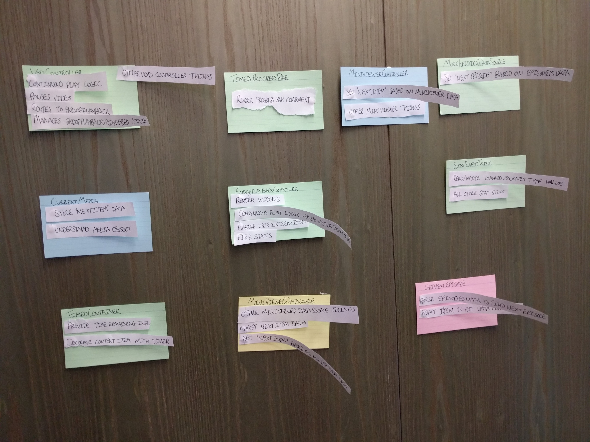
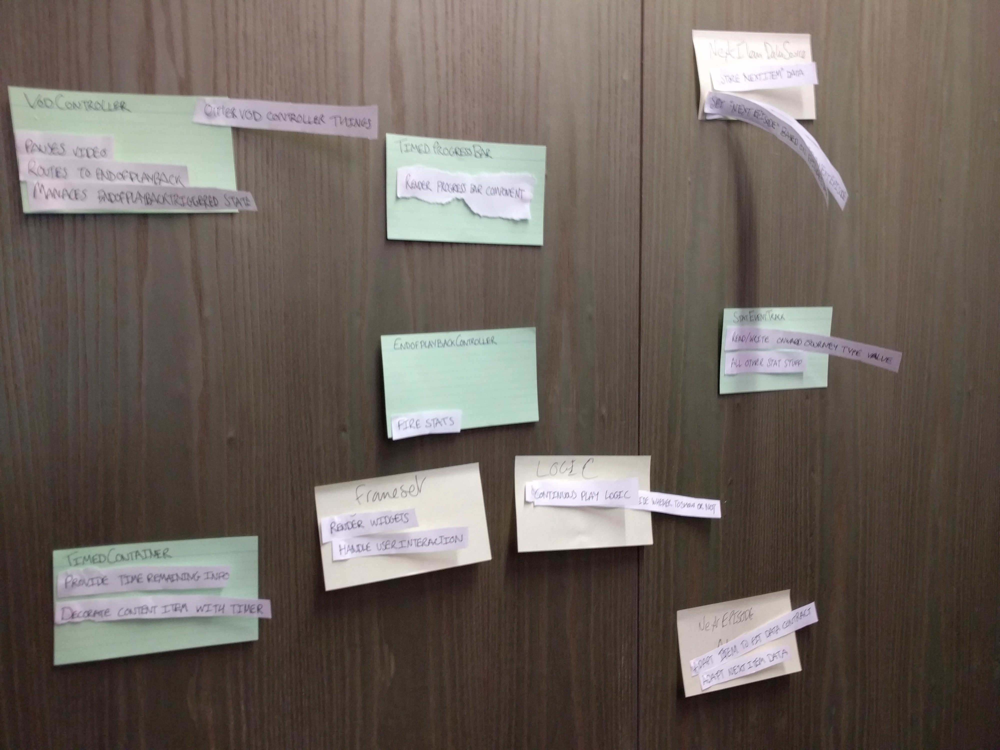

On some discussion with colleagues I realised that a technique I took for granted is often not used by others so I wanted to do a write up of how I use them to further the general ‘make my team good at the software’ remit.

I first read about these in the White XP book but I didn’t really use them until I was introduced to them by Kevin Rutherford when he worked with us at the BBC as part of the Software Craftsmanship program we had there. So massive props to him ([https://silkandspinach.net/](https://silkandspinach.net/)).

## What are CRC Cards?
[Class Responsibility Collaborator (CRC) Models: An Agile Introduction](http://www.agilemodeling.com/artifacts/crcModel.htm)

The only issue I take with that description is the name. This may sound like semantics but I have tended to find the technique more successful if you think in terms of **objects** (ie pretend the system is actually running) instead of **classes**. But given my internal biases I think thats true of pretty much everything in software development.

## When do I use them?

The answer to this is … all the fricken time. As a ‘Tech Lead’ they are invaluable to me as they allow me to abstract myself from the code but still offer value to my team by exploring problems with them.

Often though, if you have never used them before its hard to introduce something at the start of your process. When I first started using them with my team, I started by introducing their usage at the end of a task/story/epic/whatever, until the team becomes comfortable with them and then you can start using them at the begining of your processes as a design tool, rather than at the end of your processes as a reflection tool. Anyway… onwards!

### Scenario 1

You/Your team have just finished a **task**. Woo hoo. Good job! Now is the time to reflect. Write up a CRC card(s) for the task you have just completed.

Now compare the before and after state, did you add a new collaborator? Did you add a new responsibility? Was it just a change to an existing responsibility? If we added something new was it genuinily the right place to add it?

As you practice asking your self and the team these questions, you’ll start to build the mental model of the part of the system you are working in.

### Scenario 2

You/Your team have just finished a **story**. Woo hoo! Good job! Now is the time to reflect. Write up a CRC card(s) for the story you have just completed.

On the assumption that a task is smaller than a story… then this may involve writing more cards. You should have a slighly bigger picture to work with and a genuine view on the end to end value for a particular thing. This is a great time to reflect :)

Look over the cards, ask yourself/your team the same questions as before… anything new? what was changed? was there a better place to put it? You can probably now also start asking questions like… did we introduce any new coupling (or [connascence](https://connascence.io/))? Was this the right thing to do? Did we intend to do this or is it an accident? Could we have done it better? How might we refactor this to improve it? Did this story have a wide impact or narrow impact? Is that what we thought would happen?… etc… etc…

### Scenario 3

You/Your team have just finished an **epic**. Woo hoo! Good job! You lot are awesome. Now is the time to reflect! Write up a CRC card(s) for the epic you have just completed.

On the assumption that a story is smaller than an epic… then this may involve writing more cards. This is probably the biggest picture you have had to work with.

This is a great point in time to run a ‘technical retrospective’ with your team. Have cards written up for all the objects modified/created/deleted by your epic and sit down as a team and discuss. Did you build what you thought you would at the begining of the epic? If not why not? Are there any changes in there that where completely unexpected? What would you do to refactor it?

For instance, on one of my teams I did the following in advance based on a piece of work we had just completed:

And then asked the team to collaboratively refactor based on our teams technical strategy. They did this:

They consolidated genuine duplicated logic, making one of our controllers more like other controllers in our application and reducing our dependency on some objects.

This not only acted as a knowledge share with those members of the team who hadn’t worked on the piece, but also meant the whole team could be actively involved in considering its future direction and everyone had their opinions taken into account.

In my next piece on CRC cards Ill write about how I use them upfront to aid design decisions.

## Top Tips

1. Write a card for **before** and **after** the change and then compare.

1. Write the cards based on the genuine code. Do not base it on some drawing or some memory you have of what it does or whatever. Open the code, read the code line by line, write it out as you do it. Make sure EVERYTHING is in there.

1. In my view writing a good CRC card means introducing a level of abstraction from the code. Whilst the list of collaborators might be a 121 mapping to the objects, the responsibilities should be reflective of your domain NOT necessarily your code. What do I mean by that? Well lets say you have a ‘EmailAddressValidator’ object, its responsibility might be ‘validate email addresses’ however, it might take 3 functions to do that. Responsibility > Implementation.

1. Throw them away. Often. If you can’t recreate these cards quickly then its often a code smell that your code is too complex — see ‘Software that fits in your head’

1. If you can’t fit all the responsibilities and the collaborators on one side of the card then its often a code smell that your code is too complex — see above.

1. If you are doing any kind of refactoring sessions, put the responsibilites and collaborators on seperate slithers of paper that you can stick with blue tack to the cards. Encourage people to move the bits of paper around.

1. Rememeber to include ALL THE THINGS. Common things people don’t include but you should include include:

* Configuration changes

* Changes to test code

* DB changes

* Infrastructure

*The views in this article are my own and are not necessarily endorsed by my employer.*