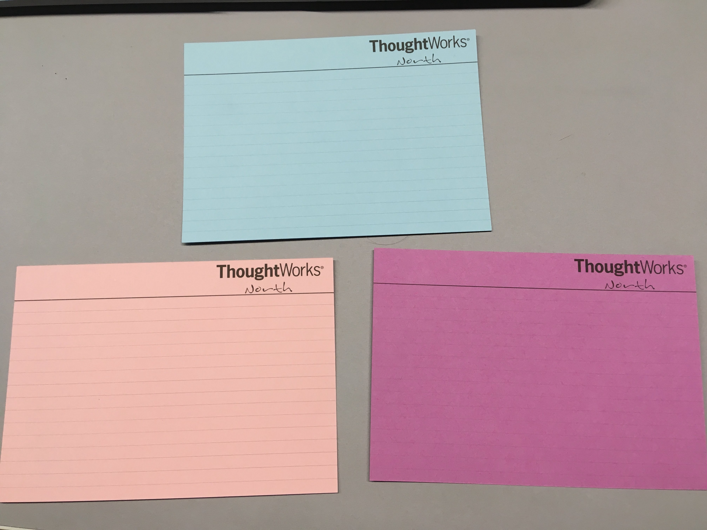

In my last article [How I use CRC (Class Responsibility Collaboration) Cards every day (Part 1)](https://www.defmyfunc.com/2018-03-23_how_i_use_crc_everyday/) I explained how to introduce the use of CRC cards into your processes by the back door. In this article I am going to explain how to start using the ‘CRC Family’ of techniques to do ‘just enough’ upfront modelling and designing to give your software development process predictability and sustainability.

I’ll hopefully also explain why I think that whilst the ‘CRC Family’ of techniques is no silver bullet, it may be one of the single biggest improvements you can make to your existing process. Done properly, it dramatically improves the alignment and understanding of your software throughout your cross functional team and by extension, across your organisation through all roles, leading to more predictable, sustainable software delivery.

I make a lot of assumptions in this article about how people work. My experience is heavily weighted towards autonomous, empowered, engineering led teams within varying sized organisations who have either made or are making the transition to “Tech@Core” organisations. YMMV.

## The CRC Family

In this part I will explain two directly related techniques that I know as ‘Naked CRC’ and ‘Physical CRC’. Generally when I say to people: ‘CRC it for me please’, I mean, ‘Do a variation on one of these 3 techniques, please’, ie. I use them interchangeably and use whatever technique seems appropriate or necessary for the occasion.

### What is ‘Naked CRC’?

‘Naked CRC’ is where you use the CRC cards, but don’t fill them in, you leave them empty. You’ve probably done something similar to this in your every day life even if you have never done it in software: ‘If the salt shaker is the shop on the corner and the pepper is you then you turn left’. This technique is the ultimate in lightweight modelling. You use face to face communication to describe the collaborators and the responsibilities rather than written words. I am a big believer in ‘Code that fits in your head’ and Naked CRC really tests that to its limits.

### What is ‘Physical CRC’?

‘Physical CRC’ is where you use the cards you have made and hand them out amongst your team. You then as a team stand up and play through the scenarios you have, where each person pretends to be one of the objects and assumes its role through the scenario. This technique is great for team alignment and making sure everyone has the same understanding.

### Why the ‘CRC Family’?

Purely anecdotely, I have found that these 3 techniques more than anything else have helped me deliver software predictably, that is simple and understood by all. These 3 techniques, used appropriately during the development lifecycle force you to work within the constraints of your team and your business. They act as a guiding force (almost a fitness function for work… [hello evolutionary architectures!](https://www.thoughtworks.com/books/building-evolutionary-architectures)) for the size of problems your team can tackle, how they break those problems down, how they communicate to each other and the outside world and how they go about their work. If work cannot be explained and understood by the team using these techniques then its probably not work the team should be attempting to do given their current understanding/state, ergo, do more spikes, break the work down a bit more, find someone to help, whatever, whatever, whatever until you can use these techniques to explain your problem.

## Leveraging CRC Techniques to do ‘just enough’ upfront design/modelling

So now you are using CRC cards at the end of your process(es) for retrospective type activities to better understand your current state and shape your future work. I’m now going to explain when I typically use them up front to guide the design of the software.

All these scenario’s are what I consider ‘ideal’ scenarios. ie I work in teams and I don’t get to decide all the rules (damn teams! you know you want to be ruled like a king) but when a problems occurs in the teams processes and I believe one of the CRCs can solve it, I suggest these type of actions at retrospectives as possible solutions.

### Scenario 1: Ticket Kick Offs

I have found many benefits to running that **Naked CRC **is done during the kick off by one of the developers on the ticket. This should be done in such a form that every one at the kick off can understand it and the output. (Where ticket kick off’s look something like a “3 amigos”).

**Example**, here are 3 blank cards:

I might place them down in a specific order and as I place the first one say “This is the controller. It is responsible for orchestrating the View and the Model. It is also responsible for firing stats.” As I place the second card I might say “This is the view. It is responsible for managing user interaction and communicating those events to the controller. As the user clicks the save button, that will raise an event which the controller will understand and pick out the new bit of data we are interested in sending in the stats we are already currently sending.” As I place the third card, I might say “This is the model, there is no new data required in the model, however, as the property you are asking to be sent is an amalgamation of two fields, we are going to do that in here.” All 3 down, I might say “This is the change we are intending to make to support this ticket, lets play the scenarios through and the AC’s and see what the scope of the change is.”

As you then create the ACs, you judge the solution against them and change the solution accordingly. You may of noticed that I didn’t mention any tests, so as a minimum, in this example, I’d be talking about the test code that needs to change to support it. But obviously, IRL, you go with the flow and change accordingly to support what you need to support.

**Outcome**, during the process hopefully you will all be getting a shared understanding of the work required to complete this ticket. The first thing that should become obvious very quickly is ‘is this ticket too big?’. If everyone in the ticket kickoff can’t keep track of whats going on, then you probably have a ticket that’s too big. Excepting that circumstance, once everyone is agreed on what the ticket involves and changes made to the suggested implementation via the CRC process, we all go our seperate ways, everyone has a much more concrete idea over what is going to be done and what impact this ticket will have on their role.

**Positive side effects**, I often ask the developers in the 3 amigos to make the outcome concrete and visualise it as they work on the ticket, ie. switch to CRC, so they signal their intent to the rest of the team on the change they are going to make. As they do the work and as things don’t quite pan out how everyone expects I would expect this to be reflected back to those involved in the kick off, helping them change their work as necessary. Significant differences should be used as a smell to ‘re-amigo’ if necessary.

**Why Naked CRC over CRC? **It’s more lightweight, it proves understanding and you have to do just enough ‘pre work’ going into the ticket to make it work and also . It’s less imposing than CRC to people who are ‘less technical’ (whatever that means), it forces collaboration and aligned understanding across disciplines as people are more likely to challange, it encourages involvement and participation because if you switch off during the ‘3 amigos’ . And finally, in most scenarios (though not all!) it acts as a natural limiter on how ‘big’ and ‘complex’ a ticket can be because it forces ticket sizes to fit the size of the teams head. Finally, I am a believer of the ‘to prove you understand a topic, teach it’ and Naked CRC above all other techniques requires a level of understanding of the problem, as well as being an excellent aid for teaching.

### Scenario 2: Epic Level Kick Offs

Firstly, I generally use CRC to help design the solution. I generate new cards for all the initial affected parts of the system(s), I then work with the team to add the new Collaborators and Responsibilities to these cards as required. Once we have a candidate, I then use Physical CRC to play through all the current known scenarios.

Give every team member a card and get them to act out their part in the scenario. This might involve saying things like: “I am the View, when a user interacts with the button I fire the event with this data on it”, “I am the Controller, I am listening for the ‘Button Clicked’ event, when it is fired, I parse the data from the event looking for the new data item and calling the stat library with the required data’.

**Outcome**, everyone on the team should have an understanding of the desired solution because they have been a part of making it as well as having played through as a team, all the known scenarios.

**Why Physical CRC over CRC? **Physical CRC really highlights any [‘connascance of timing’](http://connascence.io/timing.html) issues the solution has. Its often easier to spot other things (like coupling, too much responsibility, etc) by how much one person talks during the scenario play throughs than it is in on paper. People ask questions when they are forced to act something out that they don’t when they are reading.

### Scenario 3: Debugging

Much like a rubber duck any form of CRC done during a debugging exercise is worth its weight in gold. Even if the ‘solution’ is easy, its often worth playing through a CRC to gain the right level of abstraction helping you spot things you haven’t thought of.

## Summary

Hopefully I have convinced you over these 2 articles that CRC is worth a shot :) I made some bold statements and I hope you can see the value. Unfortunately all my ‘evidence’ is anecdotal and based on experience, not facts.

Regardless of whether you belive me or not enough to try I think CRC is one of the great team alignment tools in the ‘Tech Leads’ toolbox. And through alignment come a lot of other good things. CRC massively improves code ‘understandability’. Not only does it help people come to terms with the current code, it also helps the team align over what good looks like for them. It helps that team figure out ‘what fits in their head’. One teams good is another teams bad after all. But not only that, CRC more than any other tool shines an uncompromising light on what you don’t know. It helps the team figure out what they do and don’t understand, what things they need to investigate and spike, where the dragons are.

It also does the same for complexity. Allowing the team to understand the complex parts of their system(s) as well as allowing the team to express what is and isn’t complex for them, abstracting things at the right level, for them.

In a future article I’ll talk about how these techniques (and others) relate to the [cynefin framework](https://en.wikipedia.org/wiki/Cynefin_framework) to help teams make decisions.

*The views in this article are my own and are not necessarily endorsed by my employer.*
