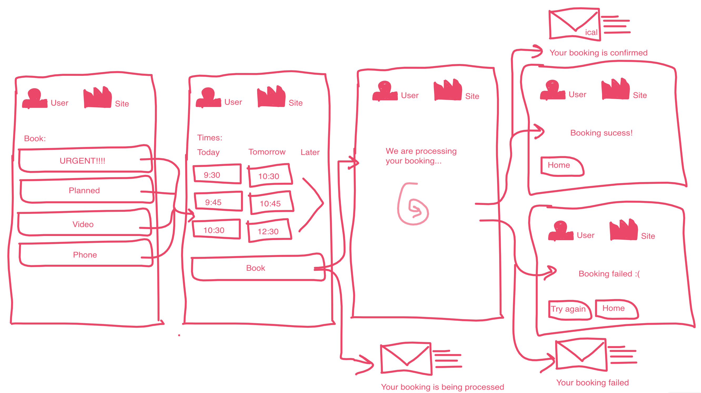
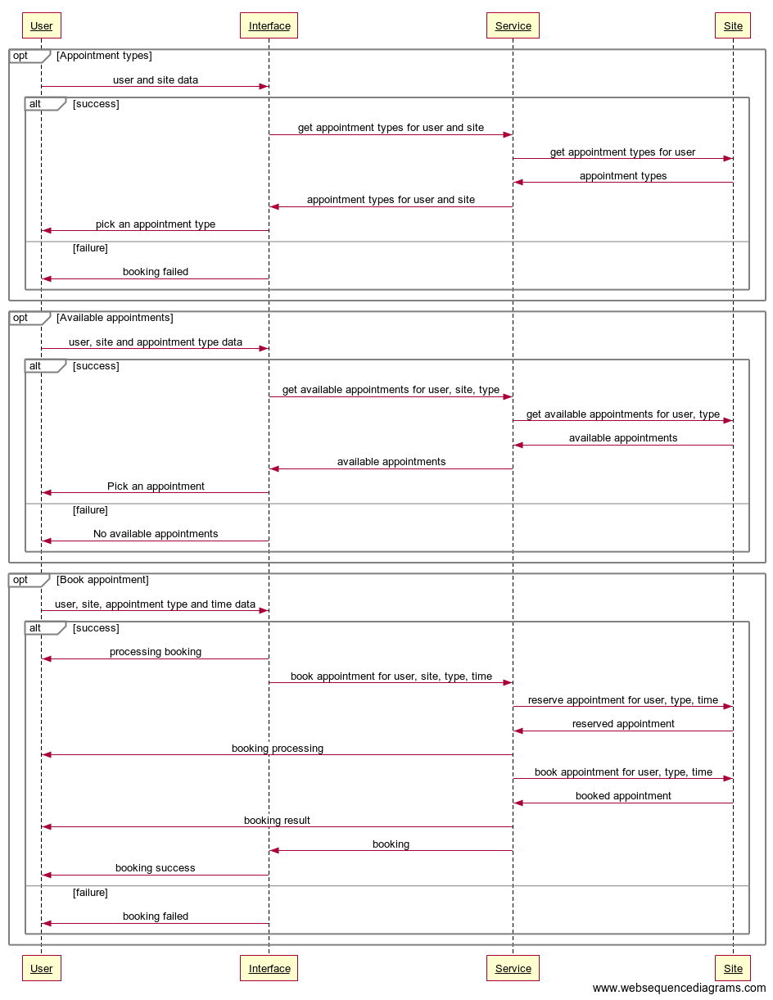
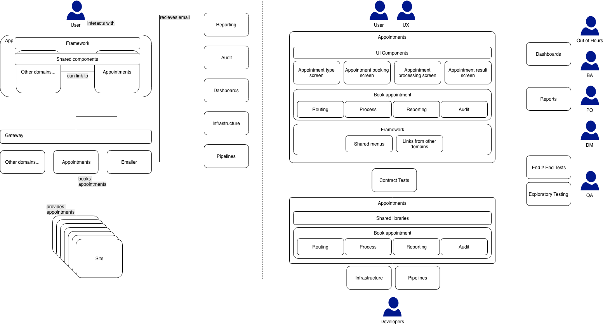
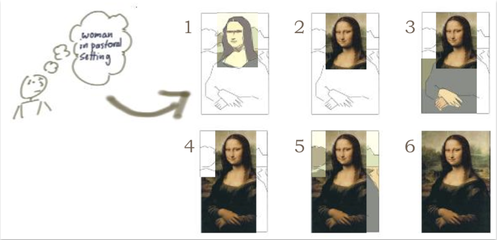
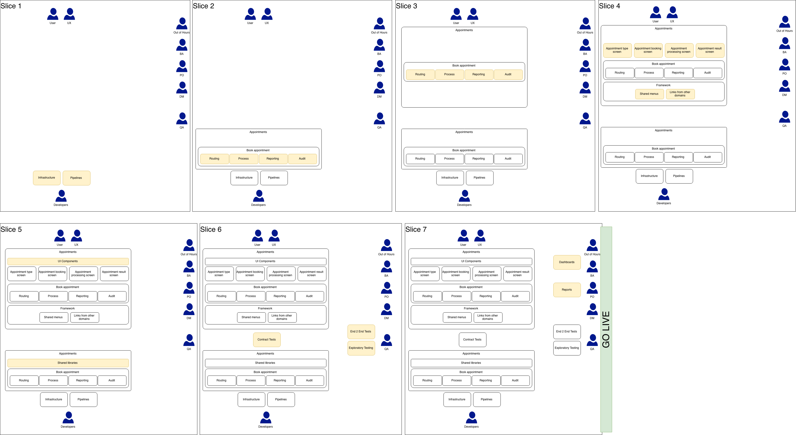
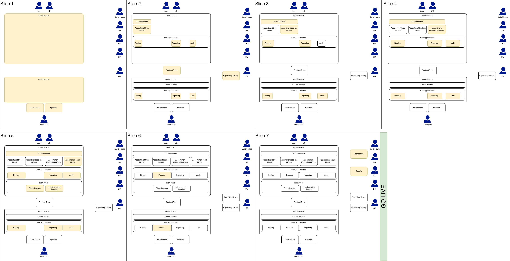
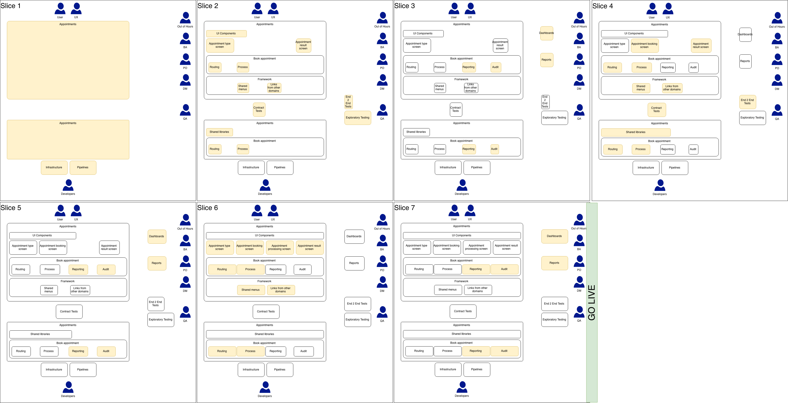
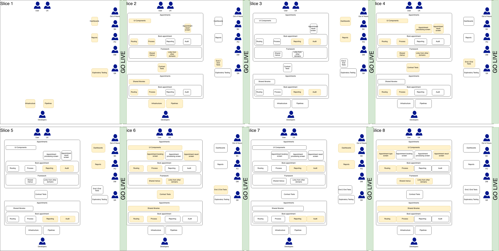

> This article originally appeared on medium at https://medium.com/@defmyfunc/releasing-value-in-software-development-184647f595ab

The ability to appropriately slice up work is integral to solving problems in software development today. At a macro level, where we often talk about ‘big bang’ releases vs continuous delivery, at a micro level with ‘trunk/master development’ vs ‘pull requests’ and every thing inbetween. It goes without saying that I have a somewhat developer centric view of this, but it applies to every member of the team. So why, in our down time (whatever that means to you! :) ), do we not practice this incredibly valuable skill?

I am not going to attempt to answer that question. Merely pose it as a ponderence. :S :)

Instead, I am going to talk through an imaginary problem, how I might break it down, etc. I’m going to talk about the reasons I would do it like this, the trade offs I know I am making, etc, etc, in the hope that its useful to see the stages of a thought process in a more concrete way.

I have found slicing to be as personal an act as anything else we do in a creative task, with lots of heated debate. In my opionion, it is worth aligning as a team around the act of slicing value and come up with team guidlines on how value is sliced that way, so that everyone understands why delivery is like it is.

Through this article I will explain some of the different ways I have seen, experienced and done slicing; the broad ‘archetypes’ of slicing. We will look at some ‘bad’ ways of slicing and move through a common ‘slicing journey’ that teams go on as they improve their approaches to delivering work. In the end I will articulate what I think is a ‘good’ way to slice work for product teams who are seeking to iteratively deliver value to their users.

It’s worth pointing out that:

* I am not going talk about any specific technology that could be used to solve this problem

* I’m not going to go into detail about how to generate the things needed to get to this point, ie I am not going not going to talk about how to create a ‘Tech vision’ that that has been fully formed though workshops and collaboration. etc. etc. etc. I am not going to talk about how to do user research appropriately to generate wire frames. etc. etc.

Anyway. Let’s go!

## The problem

Booking appointments with a particular individual.

Hopefully in your mind you are now picturing how this might work. So lets add some constraints:

* This is an aggregated booking system that talks to many individual booking sites, importantly it is not the master of the booking data

* It can take up to 15 minutes for the individual booking site to confirm the booking

* Users can only book appointments for themselves

* Users are linked to a primary site and can only book appointments for that site

* There are different types of appointment: urgent, planned, telephone, video, etc

* We are not doing ‘managing appointments’ (ie edit, cancel, etc), this will be serviced by the booking site providing contact details

* We are adding a feature to an existing system

* Booking via the website is just the first of many possible ways to book (ie native app, alexa, etc)

* Users will recieve notifications other than the website to show booking status’ (ie emails, push notificatiosn, etc)

## The high level solution

The first thing I usually do is come up with some high level designs for what the user journey might look like, followed by some supporting visions.

Here’s the initial UX:

With some process:

And the tech vision to support this:

Again, I don’t want to discuss today ‘best practice’ for creating these, lets just assume that whatever ‘best practice’ means to you… thats what I did. What I would say is… please collaborate as a team to create them, and, I think things like this are necesary to understand how to slice a problem up to make sure you are constantly delivering value.

## Slicing

There are many ways to slice this, and so I am going to go through a few different approaches. At ThoughtWorks we promote vertical slicing, but I want to show a journey through slicing and different types, ie to illuminate the different approaches outlined in the following drawings by Jeff Patton:

- Incremental delivery:

- Iterative delivery: 

- Combined Incremental/Iterative delivery:

So lets talk about some different approaches…

As a note, I am going to assume you can only do **one ticket at a time** to encourage the discussion around priotisation of tasks and avoid talk of parallelisation.

### 1. “Technical Slicing”

By which I mean, that technical areas drive the focus of the slices of work, often happens when “the business” is seperate from “technology”. And happens at the macro and micro level. For example, a lot of teams break a story down into a list of ‘technical tasks’ at the micro level or their git commits are a series of “technical slices”. Very rarely is it the right thing to do even then, and almost never the right thing to do at the macro level.
> “Create the Pipelines”, “Create the infrastructure”, “Create the router”, “Integrate with backend”, “Create the appointments screen”

The main problem being that this almost always leaves you in a position where you cannot release value to your user.

Whilst there are many manifestations of this in a backlog, it often happens when the value that can be delivered appears to be in its smallest chunk. So in our case, the smallest chunk of percieved value would be ‘as a user, I wish to book an appointment, …’. This then would then be percieved to be the smallest amount of value that can be delivered to the user.

It might look something like:

Side effects that often happen are reduction of quality, increase in technical debt, more production bugs and more time spent reacting to live issues. The Product Owner often pushes for things to be released sooner and quality is often the first casualty.

### 2. “Screen Slicing”

Where the value is sliced by screen and so the technical delivery matches that which is needed for each screen. Often the first step taken when teams become full stack as it allows the team to consider tickets in their entirety. However, often, work doesn’t directly relate to a screen and these get sliced by “Technical Slicing”
> “As a user I need to be able to select an appointment time”, “As a user I want to select an appointment type”, “As a developer I need some infrastructure”

This is often as well the start of the journey of understanding other users. For instance, we can term the report that the Product Owner needs a ‘screen’. We can term the metrics and dashboard that the team needs to successfully monitor their application a ‘screen’

What it might look like is:

Whilst the eventual “Go Live” date may be roughly similar, and so there is often little benefit there, this is generally because process can only be considered once a number of the screens are completed. You can however, start demoing percieved value very early, for instance, working screens can be demoed to Product Owners and the other teams so confidence in progress is a lot easier to generate.

Learnings can and will be made early from this and given the assumption that this team is on an “agile journey” I would hope that they wouldn’t blindly follow their plan and adapt accordingly. This can be both a blessing and a curse as it is somewhat ‘false’ feedback, in that, it can often lead to Product Owners and other stakeholders letting “perfection get in the way of good” if people are not careful.

### 3. “Process Slicing”

Now we are getting somewhere! (In my humble opinion :P). Whilst we still often have a first slice that is ‘Technical focused’, after that, we end up with a real sense of iterative delivery towards a goal. On the downside, we still haven’t really considered how we might “Go Live” sooner, but the way our work is sliced means that we can take a holistic view on what is actually important at each step.
> “As a user I need to be able to select an appointment time”, “As a user I want to select an appointment type”, “As a developer I need some infrastructure”

This lack of focus on going live can often mean that reporting/metrics/observability/etc will often be done after the slice that implements the functionality. Though it wouldn’t take much to switch this round.

Another downside is that often that “slice 2” can often be a little big. It can involve lots of ‘boilerplate’ activities and setting up of things we need in the future.

“Process Slicing” does have all of the benefits of “Screen Slicing” and also starts to mitigate some of the risk of doing the wrong thing as you start to orchestrate the process sooner. Whilst you aren’t getting feedback from live users around this you will be getting feedback from internal mechanisms.

Often this can feel the same as “Screen Slicing” from an overarching ‘user story’ point of view, this tends to happen as the team get better at defining Acceptance Criterea for those stories.

### 4. “Bottom Up, Common Failure Slicing”

With “Shared Failure Slicing” we take “Process Slicing” as a base and apply some rules to it.

Firstly, we priortise the ability to measure/report/observe over and above the functionality. In this case I haven’t talked about other cross functional requirements but I think they equally apply in this model. For instance, security, we could easily have authentication failure as a common failure scenario. There are a few cross functionals that don’t really work in this pattern, the most obvious being scale. Care should still be taken to make sure those CFRs that aren’t ‘common failure’ scenarios are included.

Secondly, we prioritise ‘Common Failure’ paths over and above ‘happy’ paths. I would describe ‘Common Failure’ as ‘the obvious failures that as a team you already know you are going to have to build’. For instance, in our case, we know we are going to have to build a ‘result screen’ that displays errors to the user for when we fail to book an appointment. So why not build that first? Why not use that to drive iterative release of value to your users?

Most of the time this just requires simple text changes as things are released. For example, we might in the first instance release this with a ‘result page’ that simply said ‘Contact your site on XXXXXXXX to book an appointment’. We will be doing almost a form of fake door testing. How many of our users are interested in appointments, do we understand the data, etc etc. We can then iterate from this base and make decisions appropriately.

Thirdly, we work from the bottom up, which the high level designs allow us to do, so we start at the end of the value chain for the user. In our case, booking an appointment. To do this we will have to make some **decisions**.

**Warning, slightly patronising view coming:** To be able to make decisions you need a high level of maturity in your organisation. Before you do this, ask yourself and your team “Do I have to ask the opinion of people outside my team to make this decision?” Broadly speaking, if an impact is only felt within one “domain”, the team should have full autonomy around that decision.

For instance, what if we just booked the “next available” appointment instead of giving the user a choice? This won’t suit all our use cases, but given we have the concept of “urgent” it makes sense it might suit those right?

I’ve called this “Bottom Up, Common Failure Slicing” but I know this as a mix of “Failure Driven Development” and “Monitoring Driven Development”.

## Summary

What I have tried to show is that, often, your choice of tech can become irrelevant. It can of course become a hinderance, but often this is because it has limitied your ability to make decisions rather than because of some inherently bad thing about that technology. A team who aren’t responisble for their own decision making around whats best for their users will always struggle to release value regardless of the technology used to deliver it.

I would encourage you and your team to think about how you slice up work and help each other understand whats appropriate for your team and your users. Hopefully, I have given you some example of how you might do things differently. I also love hearing about different ways and approaches of doing things so please let me know of any other approaches I should investigate.

*The views in this article are my own and are not necessarily endorsed by my employer.*