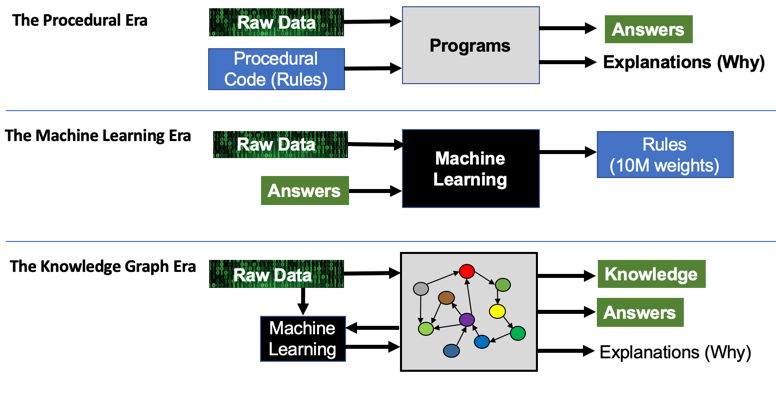

As AI/ML becomes more and more fundamental to how we treat patients we need new ways of understanding what went wrong and why when the worst happens and people ‘blame it on the algorithm’. This isn’t a good enough answer for social media as those organisations are finding out, and it isn’t good enough for healthcare.

I am lucky enough to currently working in the healthcare domain, and have had some previous experience in AI/ML projects as well, although I am no expert in either and have not done anything as of yet that mixes the two.

The benefits in healthcare are clear. At the moment, there is no way we can train enough doctors to cope with the healthcare demands of the future. And whilst doctors are unlikely to disappear anytime soon, the doctors who aren’t using AI to aid their role might. (I might add I think this is going to be true of a lot of professions).

As it stated in:

<iframe width="560" height="315" src="https://www.youtube.com/embed/Y99Ukze18Pw" frameborder="0" allowfullscreen></iframe>

pretty soon, saying “my software has AI in it” when its being sold is going to sound as stupid as saying “my software has a database in it” sounds now.

NB: This is one of my favourite 10 minute talk on the problems with healthcare and how its currently measured and the need to switch to patient and value driven measurements:

Anyway, I was recently at a meetup around Pathology where there was a brief talk around the melting pot that is Pathology, Clinical Informatics and Software development. It was suggested during the talk that the people writing the software should, in this brave new world, be held to the same standards as those who treat patients now.

That is, they should sign up to a professional code of conduct, be added to a register, and be able to be struck off that register when they act badly.

My initial reactions was, to put it politely, “I disagree strongly with that view”.

Obviously, time passes, things change… etc etc.

I think what is true now, is that I better appreciate the principle that “If you make a decision about someone elses health you should be accountable for that decision and act in the best interest of that person”

Whilst software has long been part of the health ecosystem, it has mainly centered around monitoring and providing data. What’s about to change is that with AI there will be a rapid increase in software that doesn’t just provide advice to physicians about a condition and the next course of action, the AI might make that decision and decide on the appropriate course of action.

It’s my opinion that it cannot safely make that leap into the mass market WITHOUT providing explanations.

My current experience with ML is one of it broadly being a black box. We feed our models with data, more and more. The more we give it, the better it gets. But when we then use the model, in live, for example to provide recommendations to customers, we can’t explain *why* the recommendation is being made. We can have a good guess…. but as things get more complex our ability to guess is going to get worse.

Just as we are striving for Observability across our complex distributed systems, we need Observability of our AI/ML. To be able to hold people to account, we need to be able to explain the decisions that have been made.

Without this ability to hold people accountable (the basis of our legal system), ML and AI will not be able to make the inroads.

There is an article I like here about this problem:
[Knowledge Graphs: The Third Era of Computing](https://medium.com/@dmccreary/knowledge-graphs-the-third-era-of-computing-a8106f343450)

This diagram from that article:

I think is a really succinct way of understanding the difference.

The “Procedural Era” has one disctinct advantage over the ML era. Its basis in law. Humans can provide explanations, that can be discovered after the fact.

Until we can provide observability of the decisions being made by increasingly autonomous software and explain those decisions we won’t have accountability, which is vital to patient well being.

*The views in this article are my own and are not necessarily endorsed by my employer.*