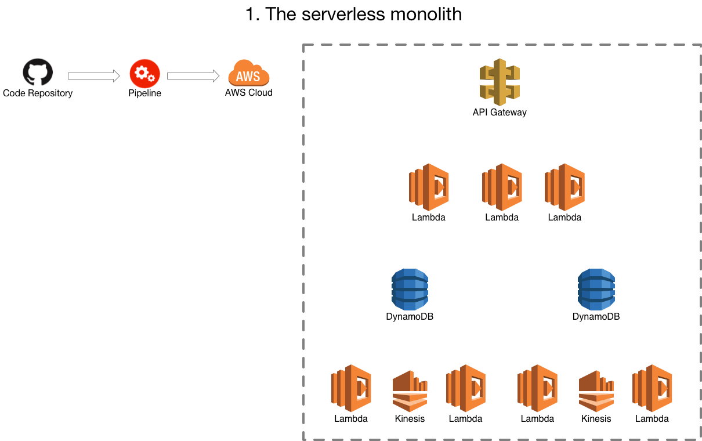
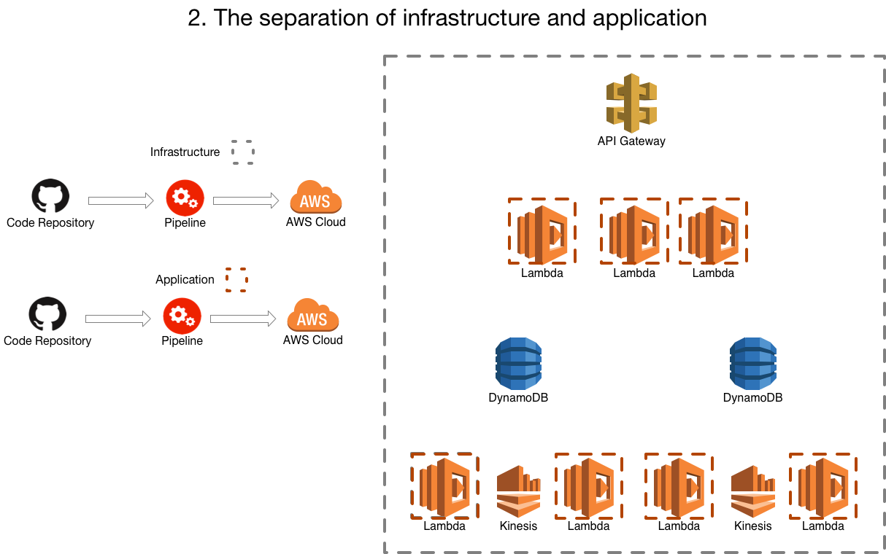
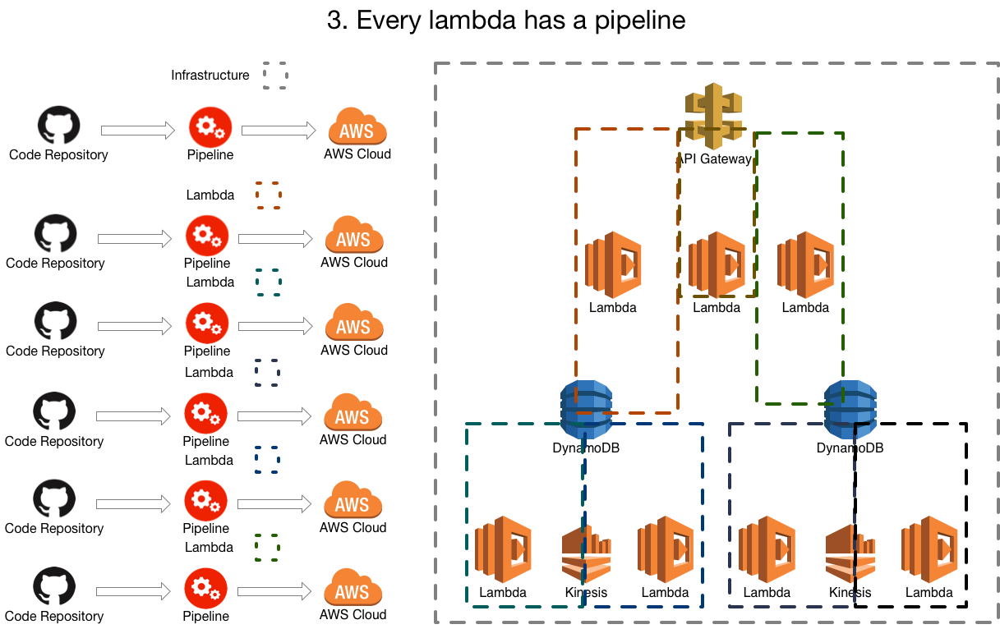
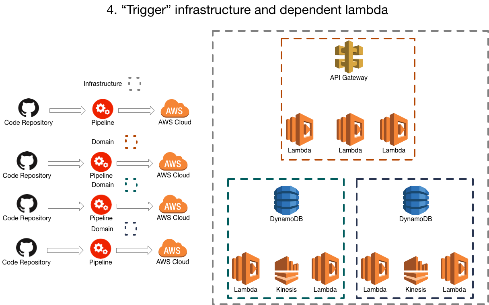
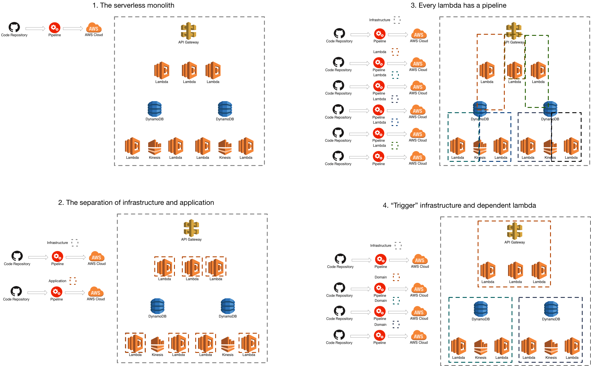

> This article originally appeared on medium at https://medium.com/@defmyfunc/serverless-deployment-patterns-and-techniques-442e7af6e4b0

As serverless has evolved and grown there have been a plethora of architectural patterns growing around to support the problems we are all trying to solve. Key to a strong architectural pattern is an understanding of how those pieces are broken up and deployed to live. Without that, the pattern is useless. I’ll explain the patterns I’ve tried before and which one is my current default approach.

Its very AWS specific, but I think the core tenets can be applied to any serverless deployment. Sorry about that if its a problem.

As ever, comments, thoughts and other approaches are appreciated.

### Terminology

**Pipeline** - Something that manages the movement of code in a repository to being run by your users, often has phases such as:

* Test
* Build
* Deploy to Int
* Deploy to Live

## 1. The serverless monolith

Where you have one repository and one build pipeline for it all! Infrastructure and application. I don’t know if I need to talk about the difficulties in this one. If you are starting from scratch and want to learn fast… the right way to go :) But at some point you will probably want to move on from this.

## 2. The separation of infrastructure and application

Where the infrastucture (using [terraform](https://www.terraform.io/) or [cloudformation](https://aws.amazon.com/cloudformation/)) has one pipeline and the application ( most likely a bunch of lambda’s) that use that infrastructure have another.

You might still have one repo at this point and you might be doing something funky in your build process to make sure changes only trigger the appropriate pipeline or you have 2 repos, one containing the infrastructure and one containing the application.

This is probably closest to traditional (non-serverless) architectures. Where the infrastructure deployment is responsible for things like API Gateway, Database creation, Queue creation, the lambda ‘placeholder’ but not the lambda itself.

This means you can start to independently deploy your application from your infrastructure. Often there is [“connascense of timing”](http://connascense.com) issues, where things need to be pushed through the 2 pipelines in specific orders, or perhaps certain steps have to be re-run once another one has finished. The lambda placeholder in the infrastructure is the biggest source of pain, as the lambda can often end up in a weird state, unless you do some engineering to make the infrastructure pipeline deploy the latest version of the lambda.

Whilst the application can be released independently as long as you aren’t changing the database tables/queues/etc it relies on or what not it can still be a pretty painful place to live.

## 3. Every lambda has a pipeline

Where each lambda has its own pipeline and deploys the infrastructure alongside. Often this co-incides with the move to a framework like [serverless](https://serverless.com/) to manage the infrastructure the lambdas are dependent on. You are probably still using terraform or such to manage some other bits and bobs of your infrastructure but this can be minimised by using serverless.

This gets rid of a lot of your “connascense of timing” issues and can really help speed up development. Isolation around lambdas mean that developers can feel a lot more free. And whilst development can speed up, often releasing can be slower as the application gets more complex. This is because the isolation of individual lambdas hides the coupling across the application. It can get difficult to manage this across your estate in your multitude of buckets, queues and lambdas.

This often coincides with an increase in the number of repositories being produced and used across the estate (by default, one for each lambda), again, unless engineering effort is put in to challenge this. This can have a massive impact on the “[locality of connascence](https://connascence.io/locality.html)” which can be detrimental to the health of a system unless properly managed.

## 4. Each “Trigger” infrastructure and its dependant lambdas have a pipeline

A common pattern when moving to serverless that we have seen is to have a piece of ‘trigger’ infrastructure, ie: a queue, a db, linked to one or many lambdas, and I think (although I have no basis for this think) that this is some of the inspiration behind the ‘serverless framework’ and how it allows you to define some infrastructure pieces that relate to the lambda.

This is important because often the ‘trigger’ infrastrucure and the dependentant lambda have impicit or explicit contract. Leaving aside the AWS part of the event payload, the dependent lambda(s) often understand specific event payloads from that particular piece of infrastructure, as such they often end up very tightly coupled and so it suits to be considered a single deployment.

Whilst we appreciate that this can’t be defined as a hard and fast rule… there may be some points where we need to make a decision about whether something is “more coupled” to its trigger or the thing it communicates with…

What we are finding is that more often than not, this approach encompasses a ‘domain’. Sometimes those domains are relatively small and sometimes they are relatively large but by taking this approach as the default and then considering our options we are finding it a sensible boundary of deployment.

This can be done in many ways including terraform, cloudformation or serverless, the important thing to try and get right is the boundaries and groupings of the lambdas and their associated infrastructure.

## Summary

As serverless solutions get more and more common there will be many ‘best practices’ to architecting and deploying solutions on serverless that are created and some will last and some won’t. Its too early at the moment to say and undoubtdly in 6 months the landscape in this are will have changed, however, at the moment our team finds grouping a piece of ‘trigger’ infrastructure and its associated lambdas a useful way of keeping architectural boundaries of our systems clear, whilst making live releases as painless as possible.

*The views in this article are my own and are not necessarily endorsed by my employer.*