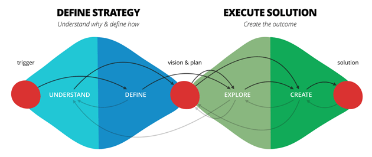
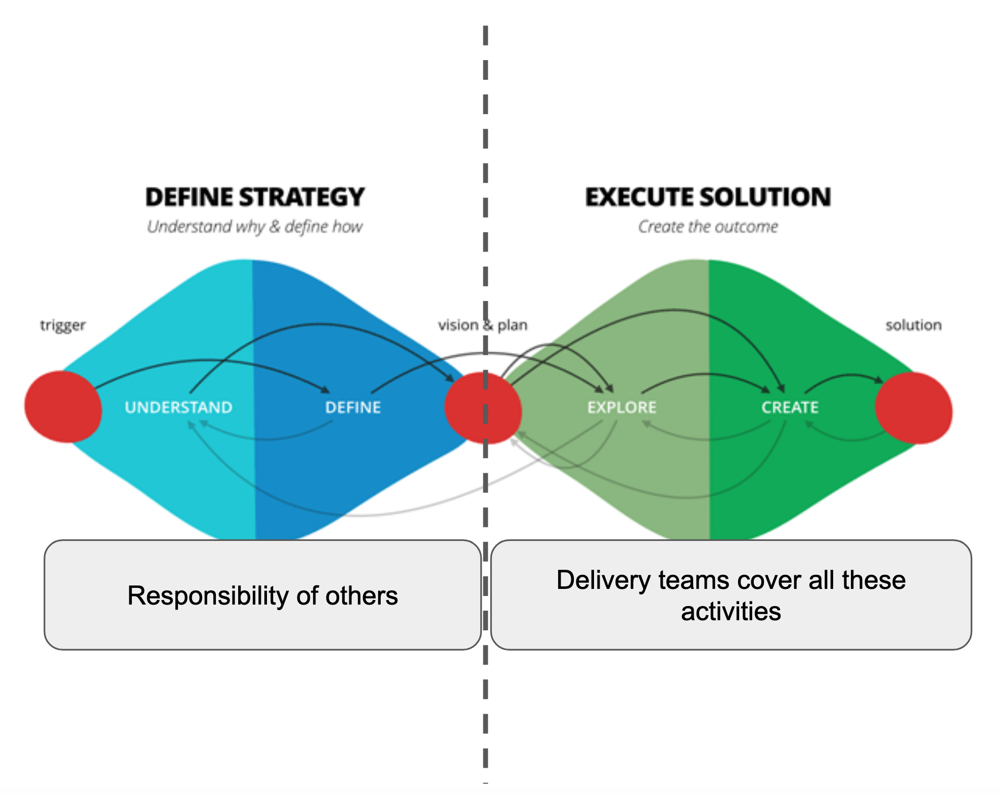
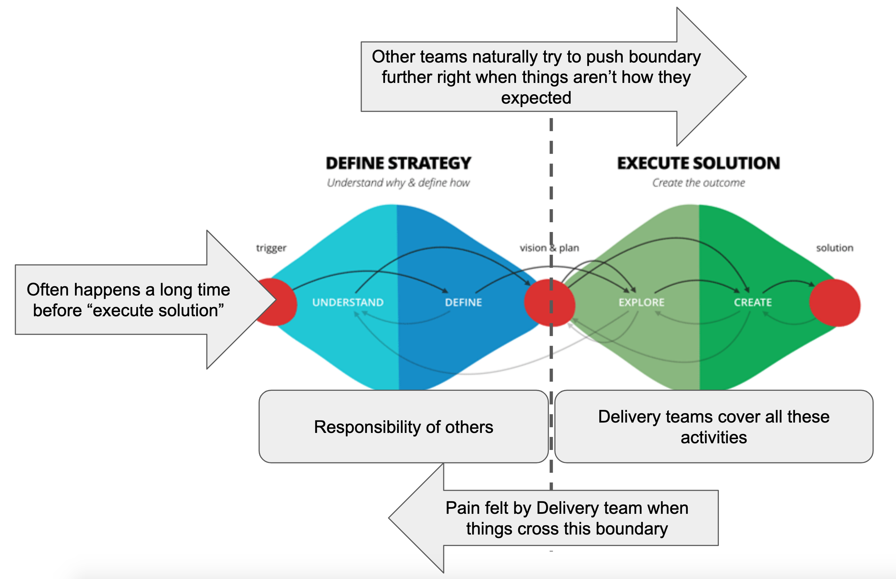
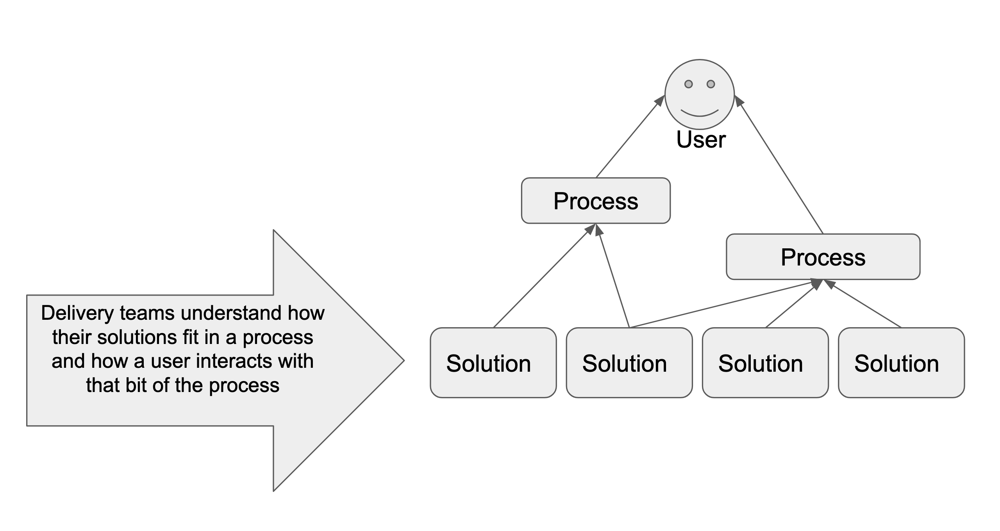
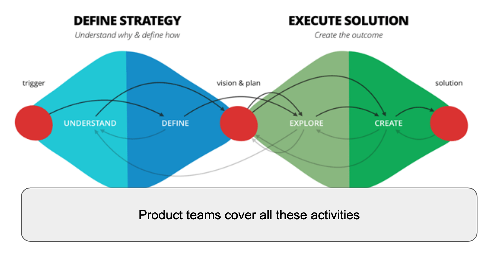
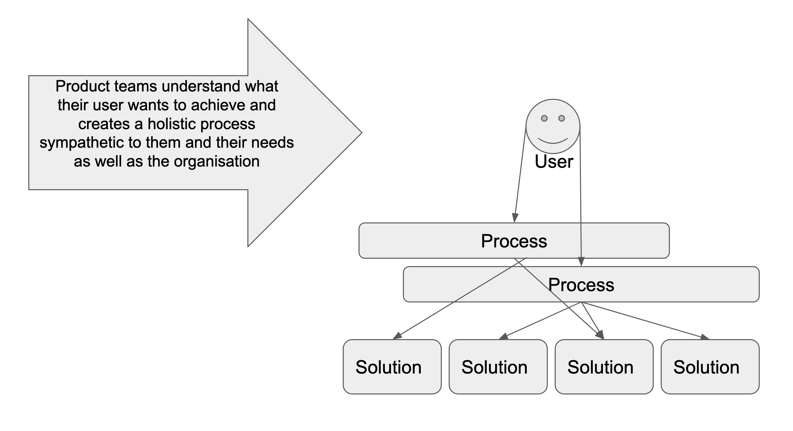
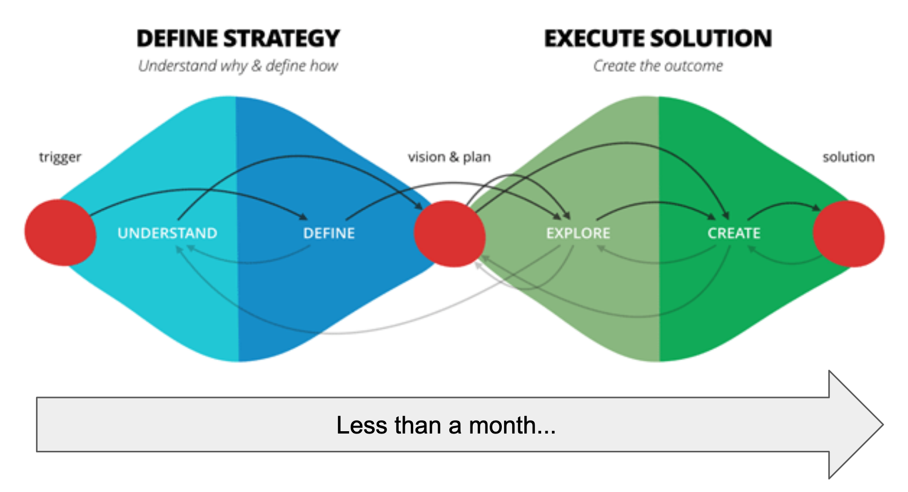

> This article originally appeared on medium at https://medium.com/@defmyfunc/the-uncomfortable-world-of-constant-discovery-or-the-difference-between-delivery-and-product-teams-7cd853872551

As “agile” and “product” development permeates more and more of mainstream software development, I wanted to write about the prevalence of two team archetypes that appear (when things are functioning well… dysfunction is a whole other topic!). Outwardly, they appear to be made of similar roles, but they often end up with very different outlooks to delivering that software and are useful in different situations. This can make comparison hard and explaining the difference between the two difficult and less easy to understand.

In my experience during a ‘transformation’ (digital/agile/product/etc) there are many stages organisations, teams and individuals go through on their journey. On that journey, to what I would describe as a ‘product’ teams, a lot of teams and organisations get stuck in ‘delivery’ teams.

Firstly, lets take a model for the activities involved in defining and delivering software. At ThoughtWorks we often use the [“double diamond”](https://www.thoughtworks.com/insights/blog/double-diamond)

### Delivery Teams

The first step on your journey is probably to move a certain population of your users from role based teams to a form of [cross functional team](https://en.wikipedia.org/wiki/Cross-functional_team). What I would describe as a Delivery team. The first roles on this journey are often Delivery, Dev and Test. BAs often come next, and perhaps, a type of Product role. Operations may or may not to some degree integrate. A lot of organisations get to this point by focussing on "DevOps". Often some roles end up shared across multiple teams, ie UX, Architecture, Subject Matter Experts. This means you have a team who can effectively execute a solution.

If a team stays in this phase or this is considered the “end” of the transformation things can get very difficult. The Delivery team don’t really understand why they are building what they are building, even if they become very good at building it. Pressure to blur the boundary back towards the right increases so that teams don’t ‘build the wrong thing’ again so processes are setup and theatre between these two sides increases. The “define strategy” phase can happen months if not years before the “execute solution” phase. This leads to more chance that the strategy that was defined, is incorrect. When the deliver team come to execute the solution they will suffer more blocked stories, more dependencies on other teams and more stories that are perhaps just plain irrelevant any more. This involves crossing the boundary to get answers to their questions, and the more times they have to do this the more pain they feel during development.

As the silos are broken (intentionally or not), good Delivery teams also work to understand the systems they build and how they fit into processes. They understand what the system is trying to achieve for their user. They can run, maintain, operate and expand those systems, they may become a good "DevOps" team.

### Product Teams

Product teams can take responsibility for the whole “double diamond”

This can be quite an uncomfortable step for an organisation to take on its transformation journey. This is because all of a sudden we are facing into the chaos of the unknown and forcing the organisation to deal with the fact that a lot of what it did before was theatre to give the illusion of certainty. However, this step is the most important and the most valuable to organisations.

Within a genuine product team, these diamonds should be happening constantly. At a micro level within tickets, at the macro level on the roadmap and in the middle with delivery of a feature.

Often we describe this as “becoming user focussed”.

Good Product teams understand what their user wants to achieve and create a holistic process sympathetic to them and their needs as well as those of the organisation.

If we are using something like a [Lean Value Tree](https://www.slideshare.net/steve236/lean-value-tree-overview-82783795) to understand our work, then its important that a Product team can get through a [“bet”](https://medium.com/@iamted/why-should-technologists-care-about-belief-96f8ef6377d1) in around a month. To achieve this, quality continuous delivery, high levels of observability and effective ways to understand their users are essential.

This means significant differences to how most organisations understand and break down problems that take multiple years to resolve which can be very hard to handle at an organisational level if it is not setup to cope with this change.

## Summary

Transformation is a constant journey, and so its useful to be able to understand where you are and where you want to be. If you find your self ‘stuck’ in a Delivery team and unable to change things its important to understand whether this is intentional or by accident. You can then start pushing in the direction you wish to go.

In reality Delivery teams should be highly transitional (but often aren’t).

Moving from waterfall teams to delivery teams is often the "easy" part of the transformation journey. These people are often desperate to work together and realise the benefit as they are much more traditional "delivery" roles anyway. This can also be achieved without significant change to quality practices.

However, without the required change in practices, the move to a product team will never happen and he transformation will stagnate and frustrate. The move to a product team is generally a lot harder for the organisation as it can involve transitioning people who have not been close to delivery for a long time and a significant change in practices and techniques.

## Appendix

### Signs you are in a Delivery team

Often created by the first few steps on the agile journey, this team will have close collaboration between Delivery, Dev and Test. Dev’s will understand the importance of quality and will take responsibility for automated testing. Test will take responsibility for exploratory testing and will be able to generate risk based approaches to testing any solution or service.

Teams are responsible for a system/service or set of. Often a complete user journey is spread across multiple teams. Operational roles have been taken on by the team, they will ideally look after their service 24/7. The team can help people understand the problem of technical debt. They may have 10 or 20% time in which to explore new ideas which are shown to people higher up in the organisation. They may have a good relationship with UX roles especially the more design orientated roles. BAs are often responsible for helping the team understand requirements and by the time a developer or tester first looks at a ticket a lot of work will have already gone into it.

User research often happens months in advance. The dev and test roles rarely if ever go to events that involve their user. The roadmap is often defined past a year in the future. The team have very little say over the large piece of work they are working on, but as that works break down they may have more and more say over how it is achieved.

The board used to visualise work is often split into multiple swim-lanes so that high priority items can flow quicker. The columns are often based on roles or environments the code has to pass through. It focuses on ‘development’ and ‘test’ and so does not contain the entire value chain, often missing out the ‘ideation’ phases of work and the ‘observation’ releases meaning that some work is happening ‘off board’ and can be hard for the team to understand. A ticket is often “done” but not “done done”. Tickets often represent a slice of a set of tasks that a single role can achieve, rather than a piece of value delivery to a user. Retrospectives often focus on the impact of other teams on this teams work which means sometimes retros can fall flat as the ability to change is limited.

NFRs/CFRs are often considered but then treated somewhat separately by the team. Sometimes this delineated by environments (ie performance testing) and other times it is delineated by dealing with another team (ie security or documentation tickets). Often the team has to produce documentation after the fact for some gatekeeper roles including (but not limited to) Architecture and Security. They may have to coordinate releases with other teams or be part of a schedule (like a release train).

People are often paid different amounts depending on the role within the team and their individual performance reviews are not intentionally linked to the teams goals. Individual contributors often generate prolific amounts of output, creating knowledge silos and reliance on specific team members for specific tasks.

### Signs you are in a Product team

They have complete control of their own backlog. The backlog is no larger than a months work and it is relentlessly pruned and prioritised. Because of this retrospectives focus on what this team can change and actions are prioritised against all other work. The roadmap is only relatively certain for the next 3 months. The roadmap consists of a series of ‘bets’ rather than requirements and it is understood that each ‘bet’ can be scrapped as its picked up by the team.

Teams are responsible for the service design, delivery and operation of an end to end process or user journey with no handovers to other teams in that process. A deep understanding or production is encouraged across the team, and the events that happen in production regularly help form the backlog.

The team is free to use solutions built by them, other teams within the organisation or external providers.

At particularly gnarly points in time, especially were something is not very well understood the team often ‘mobs’, this can be on any type of task not just “typey-typey”. Alignment of vision is valued in the long and short term, the team actively work to compromise the tradeoffs between upfront design and delivery. Upfront design is mostly done ‘Just In Time’ and is immediately followed by attempted delivery of that design. This alignment is valued by the team as a way to achieve autonomy. Any technical debt can be assigned value in the same way as a feature and so can be prioritised accordingly.

The work is visualised on a board and the columns represent value add activities. Where they don’t the team are able to change their process as they need. There is only 1 swim-lane. Everyone on the team understands how to get a ticket from beginning to end and regularly takes responsibility for this. The board includes “ideation” and “release” phases. Releases are actively monitored and observed to understand the effect they are having. Releases happen independently of any other team.

Tickets often represent a piece of value to a user. Any key gatekeeper teams (like architecture and security) are actively involved during the key discovery and solution phases the team goes through. This means that NFRs/CFRs are integral parts of the individual tickets. It is unlikely that a ticket could be solved by a single person. The person responsible for getting a ticket through the board will have to bring in a variety of roles at different points to make it happen successfully.

User research happens consistently and regularly and the team are actively involved. The research that is happening is relevant to either something that has just been released or something the team wants to do next.

People are often paid similar amounts regardless of role within the team and their individual performance reviews are intentionally linked to the teams goals. Whilst individuals bring key skills to the team that no single other person brings, the culmination of skills from the rest of the team can cover that individuals absence. Where knowledge silos occur, the team actively work to break them down.

## Links used in article and as inspiration
[The Double Diamond: Strategy + Execution of the Right Solution](https://www.thoughtworks.com/insights/blog/double-diamond)

[The Lean Value Tree](https://www.slideshare.net/steve236/lean-value-tree-overview-82783795)

[Organisation Anti-pattern: Dual Value Streams](https://www.continuousdeliveryconsulting.com/blog/organisation-antipattern-dual-value-streams/)

*The views in this article are my own and are not necessarily endorsed by my employer.*