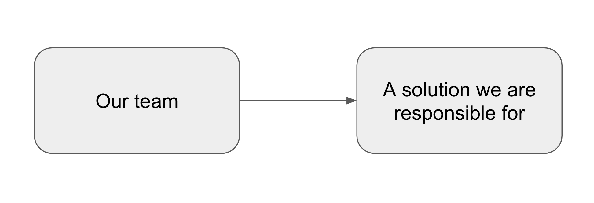
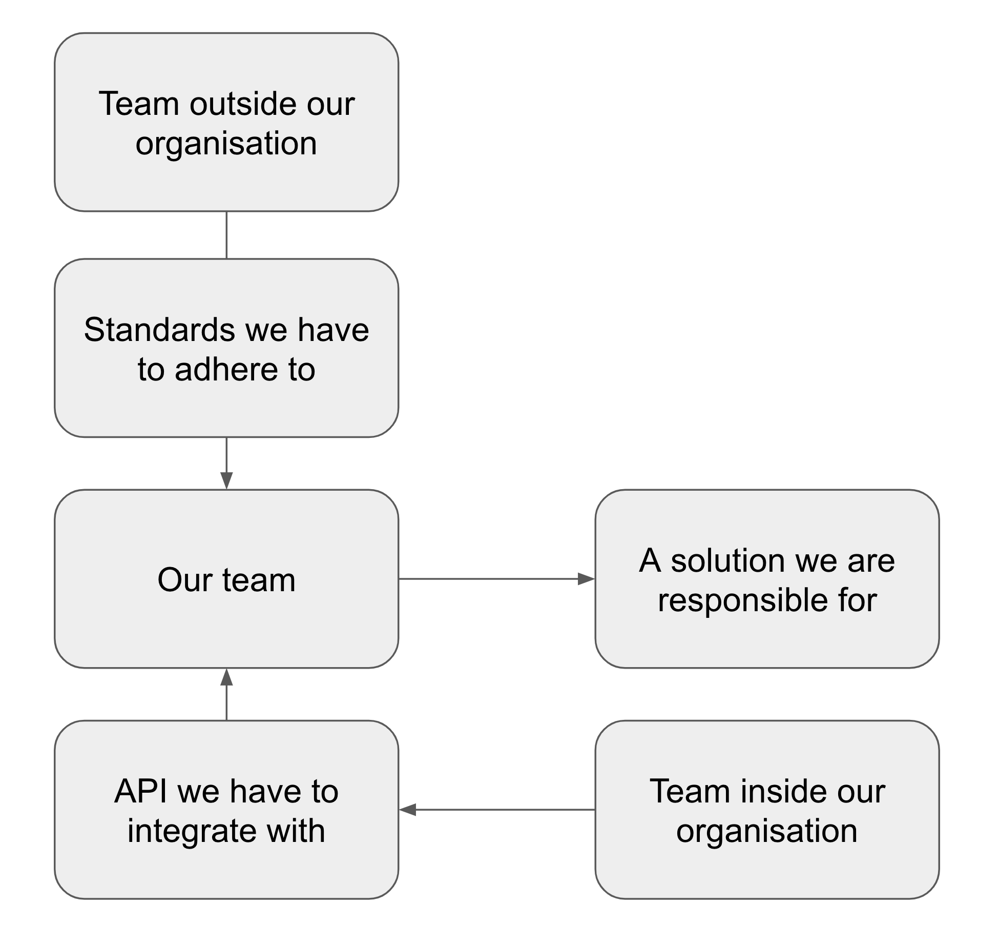

So you want to do #noestimates but some people in your organisation can't live without their estimates... how do you convince them otherwise?

But first... before we continue...

## Some important things that #noestimates doesn't solve
1. The time between the time your stories are created and when they are implemented is important. The greater the time between those 2 events the worse your estimates would have been, but also the worse any forecasts are going to be. If stories are generated more than a month in advance of the work... its going to be tough.

1. Understand what done means for you... Ideally done means "In production being used by our users" but this may not necessarily be the case for you, your team and most importantly your process control board (Scrum/Kanban/whatever).

1. Often, during estimation sessions the real value wasn't in the act of estimating... its in the act of the whole team being in a room discussing the scope of the work. #noestimates does not mean that other important activities around scoping and alignment do not happen. It just means that we are replacing estimation with forecasting. You will as a team still need to make time for these other activities.

OK... now the answer...

## Timebox all the things!
I love a good timebox. Now, a lot of agile development teams will be used to timeboxes when it comes to things like spikes, where the main objective is learning. Well guess what? Lucky you! It turns out the main outcome in product team is the learning :)

Build -> Measure -> Learn

So timebox!!

As a story is solidifying, I ask the team the question... Could you get this to done in 5 days?

I re-iterate that done means:
- In the hands of our users
- This is elapsed not working time (please consider meetings, etc)

If the answer is 'Yes'... then Yay! Well done! Whether this story will take 30 minutes of 4.5 days DO NOT THINK ABOUT ADDING ANYTHING MORE TO IT. ITS PERFECT AS IT IS.

If the answer is 'No' we break the story down.

Now sometimes... a story is resistant to being broken down to less than 5 days elapsed. Lets say it relies on an external team that can't be relied upon. If we genuinely feel this is the case, that it can't be broken down, then we leave it alone. But I make sure the team assess categorises the problem first.

## Breaking things down further
Often when problems are resistant to being broken down further it is because of one of the following things:
1. It is a problem that needs approaching in a different way
1. It is a problem that has dependencies that can't be relied upon
1. It genuinely is a problem that can't be broken down

### It is a problem that needs approaching in a different way
Take a look at my post on [Releasing value in software development](https://www.defmyfunc.com/2018-11-22_releasing_value_in_software_development/) for different approaches to slicing work that may allow you to think about the problem differently.

### It is a problem that has dependencies that can't be relied upon
Dependencies that heavily rely on asynchronous communication, especially across teams and organisational boundaries that cannot be relied upon, are tough. Its probably a little bit of anti pattern but I often split problems into tickets along the following lines:
- Outcomes
- Orchestration

Where an orchestration ticket is something along the lines of "Organise a meeting with InfoSec", "Arrange conversation with key stakeholders". These tickets are allowed to take longer than 5 days. Orchestration tickets often signify a key dependency and a high amount of them could highlight a tricky time ahead.

What is important is that there is an outcome ticket that follows immediately from an orchestration ticket. Often there will be one before it as well if there is some collateral needed for a meeting.

To aid in understanding these across the team, I often create "Logical Scope" models for the epic/group of tickets/ticket/whatever.

#### Logical scope model
A logical scope model is a lightweight mind-map of the dependencies and outputs required to consider the ticket complete.

A nice one often looks like this:

A not nice one with lots of gnarly dependencies and/or outputs may look like this:

The point of this is to help categorise problems. If lots of dependencies need to be aligned, then you had best get working on them! If lots of outputs need changing for the ticket then this could be a smell the the problem needs more thinking. You can get a good understanding of the complexity of a grouping of tickets/epic/whatever by merging the logical scope models of the individual tickets. This can really help with prioritising of tickets as it allows you to work through those with challenging dependencies first.

### It genuinely is a problem that can't be broken down
Sad. Face. Where this is the case I often think about what I could learn that would allow me to break this problem down more and spit the ticket then into at least 2. One about the learning, the other about what happens after the learning and then go again.

## So I kind of lied
This won't help you get to #noestimates automatically, Sorry. What it will help with is that you will get better at predicting and be honest about what is a wild prediction vs what is a decent prediction.

At less than 5 days, especially as elapsed, to run the "build measure learn" loop we actually get pretty good at predicting. The team becomes much more realistic about what it can and can't do and it also gets a lot better at breaking problems down. 

As a bonus the team also gets better at experimenting to learn the right answer rather than jumping to a big design and development piece.

Now, I appreciate, that some things will go over 5 days. Thats natural. But somethings will be a lot lot lot less than 5 days (hopefully!)

Combine this technique with a switch to forecasting and predictability will dramatically increase.

## Tech lead Bruce-y Bonus
As a Tech Lead the nice thing about this is that you get a clear framework of autonomy and intervention with your team. On day 3, I can have a chat about where they are up to, what tasks they have left to do, how confident they are about getting through it and what their feel for the size of this is now they have learned something. Day 4 we can have a proper chat about what value can be delivered out of the ticket and what value can't. Day 5 we split the ticket, ship what can be shipped and revert what cannot be. In the worst case, we have achieved nothing and only wasted 5 days. In all other cases we have probably learnt something very important which itself can be used to inform the backlog. This doesn't replace our normal conversation of course and isn't a rigid framework :)

## It takes time
I find it takes somewhere between 1 and 3 months for this to improve things for a team, especially when used in conjunction with forecasting. It often takes 3-6 months for stakeholders to stop asking you to estimate things and start letting you forecast things.

*The views in this article are my own and are not necessarily endorsed by my employer.*