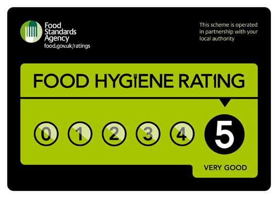

In my twitter feed recently, I have noticed a spate of analogies, metaphors and similes to describe software development (eg. https://twitter.com/jessitron/status/1165787547764551680) and so I wanted to share the metaphor I have been using for the past few years. Most of the analogies I have seen have focused on allowing for the distinct difference between building a "traditional factory made manufactured product" and the concept of "constant product development" within software delivery, where you are constantly discovering and adapting "the product" to user need. 

The analogy I use the most to compare to software development is that of "running a restaurant". 

## Why?
According to this 5 second google search for what makes a good analogy: 

- "A good analogy is a compromise between two conflicting goals: familiarity and representativeness" - https://www.scotthyoung.com/blog/2014/10/21/good-analogies/

I would also add:

- "A good analogy gets out the way quickly as the person uncovers the truth." - @defmyfunc. A person I respect once told me, "sometimes we have to stop using analogies and just explain software development."

Which is why I think restaurants make a great analogy.

## Familiarity

First, what I hope is the easy one, familiarity, A large proportion of people:
- understand the work that has to go into food preparation
- will have had food prepared for them by someone else at some point
- will have paid for someone to prepare food for them 
- have seen some form of restaurant cooking show (even if just to turn it off before Gordon Ramsey swears again)

As a bonus in the UK, we have these lovely stickers:

in every place that prepares food, which means that pretty much everyone understands there is legislative and compliance regime to food standards (even if they don't know the detail).

## Representativeness
Now the one I have to prove with stories and let you decide. I often start with the initial analogy which I use to explain the key framework items by which everything else hangs:

### General analogy
Think of your software 'product' as a restaurant, and when people use your product, thats them having a tasty and delicious meal at your restaurant. And we charge them and they pay us, and if we want them to come back, we need to find ways to show our value to them and make them loyal customers. But behind the scenes, so that our customers can keep eating tasty and delicious meals and keep paying for them, we need to do a whole host of things every day, like clean the restaurant and its equipment, clean the tables, clean the plates and cutlery and the pots and pans, ask 'how was your meal?'. And every so often we need to do things like, health and safety accreditation, or create new and exciting menus for our customers.

### Technical debt
We have to constantly work on technical debt, just like a restaurant has to clean the plates and tables to continue to provide a service. If we do all the cleaning at the end, rather than as we do service, then its going to take us longer to get ready for the next service. If we don't clean at all then its going to stop service at some point as we will run out of clean plates.

### Operability
When a customer spilled a drink it used to cause all of service to stop as we tried to clean it up, now, whilst it disrupts what we are doing we are getting pretty good at cleaning up and learning how to prevent spills when we can.

### New features and release cadence
Adding a feature is like changing a menu. We can either incrementally and constantly change our menu dish by dish, or every 6 months completely re do it from scratch.

### Sticking to a plan vs having a strategy
At the moment we detail all our dishes and laminate our menus, this makes them expensive to change, which means our customers only come back to us every 6 months and sometimes if we can't buy the ingredients we have to take things off the menu. This is hard for our staff to keep track off and ultimately disappointing for the customer. If we ***need*** to laminate the menu now, what if I just put "Fish of the day" on the menu, rather than "Cod with New Potatoes" that way I can adapt to the ingredients available. Of course ... it would be nice to not have to laminate the menu ... but one step at a time... :)

### Build/buy decisions
At the moment we are a small, bespoke, fine dining, local, restaurant, we can decide our menu just the week before, and use the fish that is fresh that day. However, this is expensive to run and our prices our high but our customer's love us and keep coming back... we could become more like McDonalds if you like... we could get really good at churning out the same kind of thing over and over... we'd need a 'set menu' that didn't have much variation, but we could buy in bulk and save loads of money as we could probably get lower skilled people to run the restaurant itself. People love McDonalds, but they love it differently to us. The trade off is, if you ask us to significantly change our menu, it might cost a lot of money as the specialist equipment we have bought in might not allow us to cook the new menu. Sure, we could crank out a new burger, but if you want us to do fine dining, we don't stand a chance. Do you want us to be Harvester maybe? Some variation in menu, and maybe once every 3-6 months we get to re-think if the menu is right for our client base? 

### Legislative requirements
Understanding data security is like understanding food hygiene requirements. Would you eat at a place that had a hygiene rating of 1? You might, if it was cheap ... :S ... Sure. Anyway, theres some stuff we have to do to meet legal compliance, not negotiable, but how we do that, if we centralise that behaviour and don't train ***all*** our staff to understand the impact, we might get a one rating and its going to significantly impact the trust placed in the restaurant by the customer.

### And many many many more...

One of my favourite past times is stretching an analogy, so please feel free to stetch this one away and let me know how you use it :)