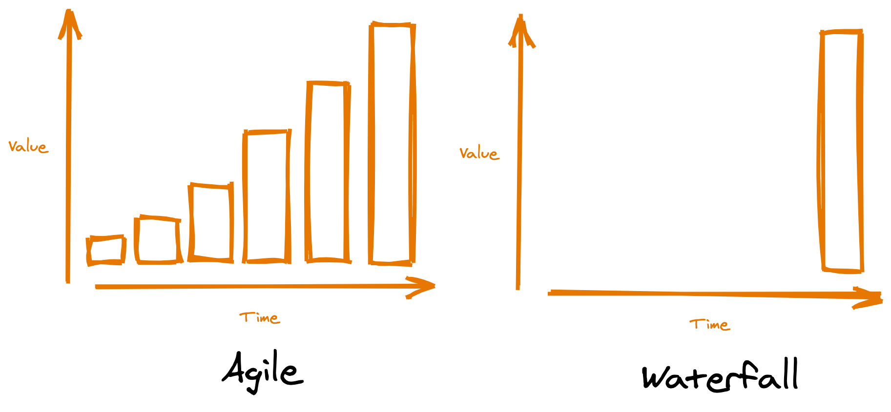

As part of the navel gazing many businesses are wont to do, one of the things that causes much consternation is the discussing whether something is 'strategic' or 'tactical'. As far as I can tell the most common definitions for these are:

| Strategic: Something which will take a long time to do and release little or no value before its 'all done'

| Tactical: A bad decision, just noone can be seen to say that something is bad

Phrases like 'well we all want the strategic solution ... but are there any tactical fixes we can do?' fly around meetings in a flurry of post its and shouts as everyone begins to realise budgets are being cut as the 'vision', lovingly crafted, is being smashed upon the rocks of reality. On a recent client a colleague of mine had to resort to dictionary definitions to prove that 'strategic' and 'tactical' weren't antonyms, such was the misuse.

So here is me, writing a post, trying to reclaim those words.

My hope, perhaps in vain, is that people will start calling out decisions for what they are. Perhaps even calling them 'bad'. 

A "tactic", by definition is something you do to achieve your goal. So a "tactical" decision is one that serves the "strategy" you are trying to achieve. It is categorically *not* something that makes your strategy more difficult to achieve, or indeed something that works actively against it.

Business leaders are simultaneously addicted to defining strategies whilst unable to execute on them in a way that delivers value incrementally. So in effort to deliver value, they resort to making decisions that often make the strategy even harder. Often of course, they are not to blame, they are often constricted by delivery that takes months or years to return any value.

Whatever your flavour of agile, one of its main goals is to make sure that at a regular cadence, value is released to users.

Things get difficult in organisations when things take a long time. Money gets spent, people get nervous that the thing will never come, users demand change. In this way, strategies remind me of this quote:

<blockquote class="twitter-tweet">
If you still follow it when it&#39;s hard, then you can claim it as a principle.
&mdash; Kent Beck (@KentBeck) <a href="https://twitter.com/KentBeck/status/1105444816458924033?ref_src=twsrc%5Etfw">March 12, 2019</a></blockquote> 

And I think the same can be said of a strategy. If you stop following a strategy when things get hard then either:
- Your are unable to deliver on your strategy in a timely manner or,
- or, your strategy is no longer appropriate for your context and needs to change.

In my opinion it is FAR better to change your strategy if you are unable to deliver on it, ESPECIALLY if its because you have learned something by trying to deliver it, than it is to pretend that the strategy is fine, and make some decisions that work against it, or don't promote it.

So how do these bad things happen? Lots of reasons I guess ... but the most common I have seen? The separation of strategy from delivery by organisational silo. The further away from "delivery" "strategic" decisions are made, often the more likely this is to happen. But this is just my anecdotal experience.

So please, if you are reading this, reclaim the word tactical and strategic in your organisation. Improve your delivery so that you can use the word 'tactical' to mean 'the things you do to release value to achieve your strategy' not 'the things we do because things are taking a long time' and reclaim the word strategic to mean the 'the thing we are all working on every day and deliver through our tactics'.

And please, if something is a bad decision. Just call it a bad decisions.