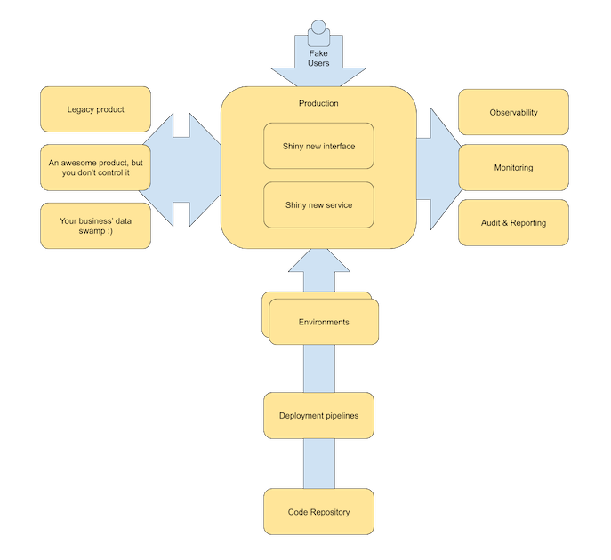

If I was to pick out what I think the single biggest difference between "Enterprise" and "Non Enterprise" software development, it would probably be the amount of integration that is necessary to achieve success. Integration comes in many forms, not just other systems, but integration across people and process as well. 

Growing Object Oriented Software Guided by Tests ([GOOS](https://www.amazon.co.uk/Growing-Object-Oriented-Software-Guided-Signature/dp/0321503627)) is one of my 'cornerstone' books as to how I approach software development, as such, I wanted to write a little about one of the most under used, and when it is used somewhat misused techniques, the "walking skeleton".

## What is a "Walking Skeleton"?
GOOS defines it as:

A “walking skeleton” is an implementation of the thinnest possible slice of real functionality that we can automatically build, deploy, and test end-to-end - Cockburn, Alistair. Crystal Clear: A Human-Powered Methodology for Small Teams. October 29, 2004.

Sometimes its easier to define something by comparing it to what it isn't:

### It isn't a prototype
We throw prototypes away. A 'walking skeleton' is production code. Its important that you have validated a user need before embarking on a walking skeleton.

### It isn't a minimum viable product
Functional, isn't the same as feature. A 'walking skeleton' should work, but it might do little of value from the users point of view. 

### So what is it?

There are probably as many definitions of what is technically a walking skeleton, there may even be a 'minimum viable skeleton' out there.

My view of a 'walking skeleton' is probably a bit closer to Dan North's "Dancing Skeleton" and I tend to approach it in a similar vein to that articulated here: [https://gojko.net/2014/06/09/forget-the-walking-skeleton-put-it-on-crutches/](https://gojko.net/2014/06/09/forget-the-walking-skeleton-put-it-on-crutches/)

When we approach developing the 'walking skeleton' within enterprise software delivery its important to take an extra factor, integration.

I define a 'walking skeleton' as:

> Something which proves all the known integrations, across people, process and tech, for a given scope. 

It does not have all the functionality required to deliver value to a user, but should eliminate the risk that a integration or dependency problem will delay delivery of that value or cause it to fail completely.

Walking skeletons are essential in the 'de-risking software delivery' toolkit. Often software delivery starts by building out the easy things ... "get the quick wins!"... but without integration into the wider ecosystem in which that software lives, the users will never see the value of that whizzy new system you are building them!

Doing the 'new feature' is often the least risky part ... a quick technical spike and you can understand whether the feature or idea you want is worth progressing. Failing to integrate can cause untold pain on the users of the system and have disastrous consequences for a business and its customers. Walking skeletons are a technique that help us front load the risk of software delivery.

The aim being we reduce risk over time rather than leave it all to the end when a shiny new product has to learn how to play nicely with the rest of the world.

## Defining a walking skeleton
Architecture diagrams hide a multitude of sins in a rounded rectangle.

The simplistic view of the walking skeleton bounds it within the context of the software you intend to deliver, and this should often, rightly, be your first pass:

I tend to think of these as a kind of fat, 'tracer bullet', recently discussed here: https://twitter.com/martinfowler/status/1184234201614372865 and https://blog.thepete.net/blog/2019/10/04/hello-production/

You should make sure it includes all the good things your hello world application needs, unit tests, functional tests, etc, etc. 

### Making it dance
I think its super important to 'make it dance' and be able to interact with it via an interface. This makes it more real from the point of view of your stakeholders. So lets add that:

You should also make sure you update your pipelines ... do you now need contract tests for example? Maybe some e2e type tests?

### Instrumenting
Being able to learn from your users and system is important, next we layer on the instrumentation so that we can learn from their interactions with our system:

This means adding integrations with the systems that we use for monitoring, observability, audit and reporting. As well as any others you can think of. Yes. Instrument that 'Hello world' app so you can observe it, change it, understand your live service needs, confirm audit, and whatever else your business requires.

### Integrations 
Being able to prove the technical integrations between systems is an important step. If you can't integrate with the existing SAP monolith ... then well may as well go home. But its not just a chance to "enjoy" integrating with a system ... this is your chance to build those relationships with those teams. Because guess what, those teams are central to your success... without them you are nothing ... and you can piss and moan all you want about how "bad" they are ... or you can knuckle down and collaborate... hell, get one of them to join your team. You might learn something :)

### People and process
Now we are getting somewhere ... but now comes the tricky part ... find a way to role play ... find a way that means you can role play your use cases in the production environment. To do this you are going to have to learn how to ["Test in production"](https://opensource.com/article/17/8/testing-production). I'm sorry ... but you kind of have to have this fight with your organisation now ... I know you've been putting it off ...  but ... ¯\\_(ツ)_/¯

Being able to role-play the use-cases through the system as you develop them is an important way of learning about what you have to do and integrating with existing people and processes across the organisation. This is the difference between a well run transition to a new process and a nightmare transition that everyone hates and means no investment for 5 years until the organisation has forgotten the pain of last time. So figure it out... a good summary of the techniques you may find valuable is here: [https://medium.com/@copyconstruct/testing-in-production-the-safe-way-18ca102d0ef1](https://medium.com/@copyconstruct/testing-in-production-the-safe-way-18ca102d0ef1)

## Phew
I appreciate this may seem like a lot of work, and to some extent it is ... but depending on your organisation you may already have a lot of this in place. Obviously, you may not ... especially if you are just starting or mid way through your 'transformation'. But there are some great SaaS services that you can get for low cost as you learn and then evaluate as you grow. And remember ... you don't have to do all of it ... you want just enough for 'hello world' in each of them.

But the benefits are worth it. If you do this you will have all the tools at your disposal to become a [genuine product team](https://www.defmyfunc.com/2019-06-12_the_uncomfortable_world_of_constan_discovery/). If you repeat this pattern then as an organisation you get very good at doing it, and whilst the first time might be hard, by the time you get to your 5th it'll be a walk in the park. And if you are feeling adventurous ... you might find you don't need those other environments at all...

The walking skeleton is an important tool in the developers toolkit, for when there is a proven need to deliver a product in a problem space. And whilst a thinner 'tracer bullet' style walking skeleton is suitable for some environments, within a heavy integration environment, like a lot of enterprises are, you may find more value in making something fatter. Its also an excellent way to de-risk the whole project and set yourself up for future success by being to adapt and learn from your users.

Thanks for reading! Thoughts as ever, appreciated.

