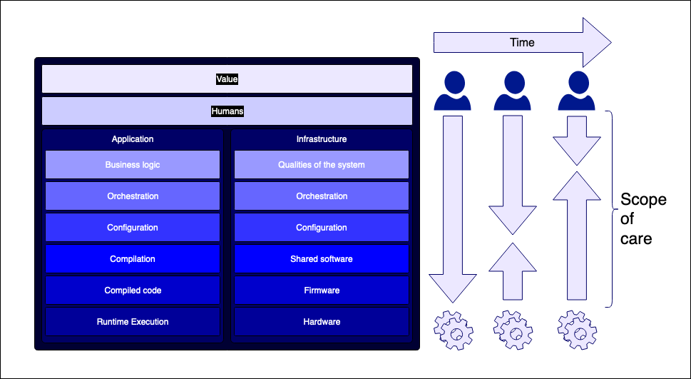

As a consultant, after the stakeholder shenanigans have been completed, often the first thing I do is go talk to the QA community. The health of the QA community within an organisation is often a key indicator as to whether the organisation is going to make it through whatever we are being asked to do. QAs regardless of whether they are constrained by the system in which they operate, have to understand the dependencies and processes that gets working software to the user, even in the most siloed of organisations. Whilst at ThoughtWorks we believe quality is a responsibilty not a role, it's my opinion that the future of software development, lies in everyone becoming more QA, in the way they think as well as the activites they perform on a day to day basis. As machine generated code moves up "the stack", more and more of our "development" responsibility will lie in defining, observing and validating the qualities of the system and its behavior rather than typing the letters that make it work. In effect, the software developer of the not too distant future... is a QA.

## (overly) Simplified Layers of Concern for a "Developer"

Whilst this is overly simplified (perhaps to the point of being useless... I actually don't think it matters if the model is correct or not necessarily... just that you could create a model for your world based on this generalisation to understand what is happening in your world... phew :S) generally, as a developer for an service provided over the internet, on something that is user facing you have the following "stacks" to deal with when you are attempting to develop value that can be released to your users

<table> 
    <tr><td colspan="2">Value (what we are trying to achieve)</td></tr>
    <tr><td colspan="2">Humans (the humans who agree on what needs to be done)</td></tr>
    <tr><td>Application (the software)</td><td>Infrastructure (what the software runs on)</td></tr>
    <tr><td>Business logic (the new thing that is being created)</td><td>Qualities of the system (the qualities we want to see in the system)</td></tr>
    <tr><td>Orchestration (the things we need to glue together to release the new thing)</td><td>Orchestration (the things that glue together to make that quality)</td></tr>
    <tr><td>Configuration (the values we need to change to make the software build and run)</td><td>Configuration (how those things are set up to make that quality)</td></tr>
    <tr><td>Compilation (the steps performed to change human readable code into machine readable code)</td><td>Shared software (what is running on those things)</td></tr>
    <tr><td>Compiled code (the code the machine run)s</td><td>Firmware (the software baked into the hardware)</td></tr>
    <tr><td>Runtime execution (the act of running the code on a machine)</td><td>Hardware (what runs those things)</td></tr>
</table>

As time has progressed the ability of machines to automate, generate, provision, whatever, those tasks involved in those processes has increased dramatically. At the moment, as humans, we probably meet machine half way ... whereas in the past we have been a lot closer to the bare metal. The theory being ... the further we are abstracted from the underlying mechanics, the better able we are to focus on generating value for our users ... as opposed to working on "enablers" that mean we can *then* focus on creating value for our users.

As a % of 'total humans involved in the development effort' there are less and less humans working further down the stack, and more and more humans able to focus higher up the stack. Its probably worth mentioning [Wardley Maps](https://medium.com/wardleymaps) here ... because hey, thats what all the cool kids are doing to visualise this progress.